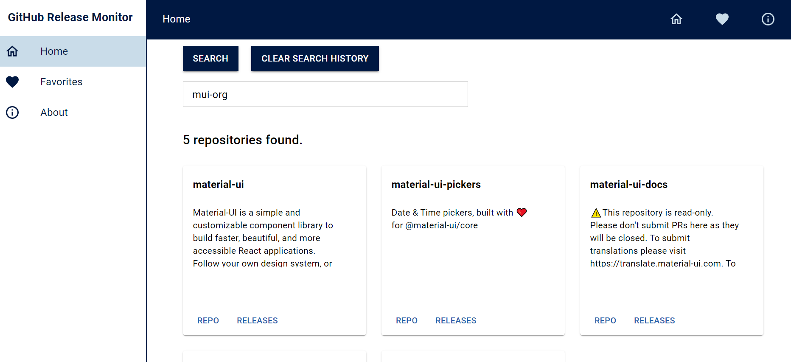
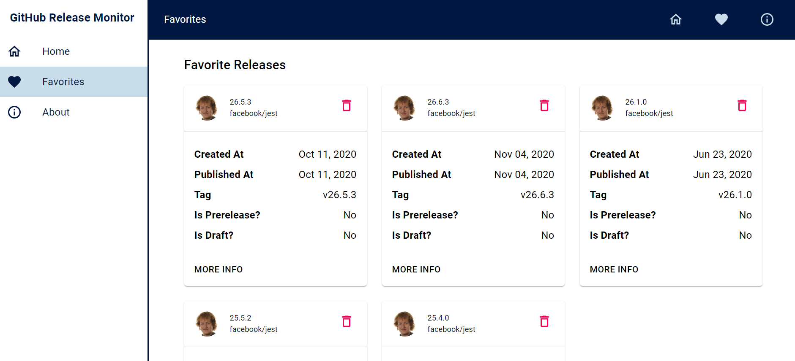
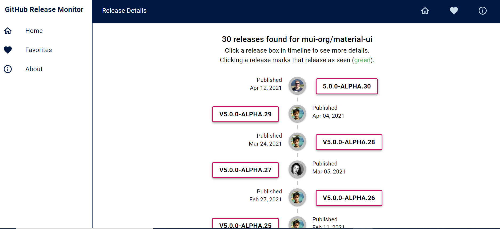
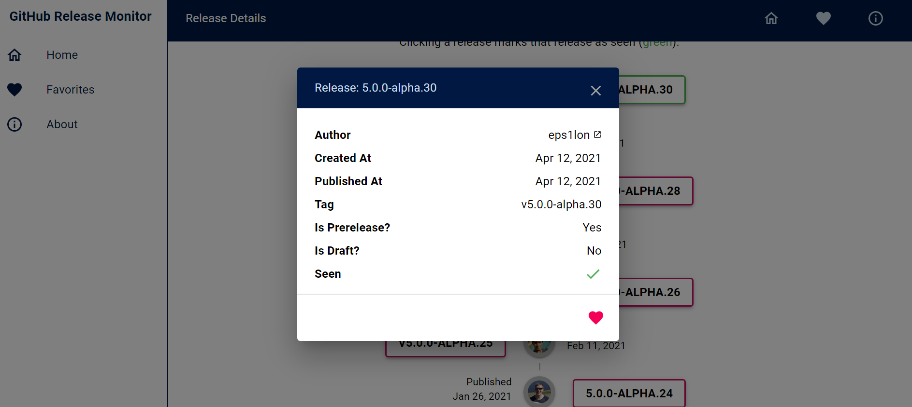
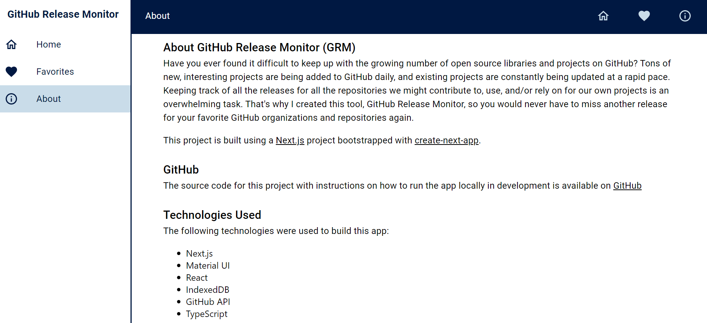

# GitHub Release Monitor

Have you ever found it difficult to keep up with the growing number of open source libraries and projects on GitHub? Tons of new, interesting projects are being added to GitHub daily, and existing projects are constantly being updated at a rapid pace. Keeping track of all the releases for all the repositories we might contribute to, use, and/or rely on for our own projects is an overwhelming task. That's why I created this tool, GitHub Release Monitor, so you would never have to miss another release for your favorite GitHub organizations and repositories again.

This project is built using a [Next.js](https://nextjs.org/) project bootstrapped with [`create-next-app`](https://github.com/vercel/next.js/tree/canary/packages/create-next-app).

## Live

The app is currently live at the following url <https://gh-release-monitor.vercel.app/>.

## Getting Started

The following section will take you through the steps of setting up this project and getting it running locally on your computer.

If you don't want to set up this project locally and just want to see the deployed app, go to <https://gh-release-monitor.vercel.app/>.

1. Download or clone this repository to a local directory on your computer.

2. Change directory to the project root directory (`gh-release-monitor`).

3. If you don't already have Node.js installed on your computer, you can install the latest version from here: [https://nodejs.org/en/](https://nodejs.org/en/).

Troubleshooting tip: If you have difficulty starting the app locally, I used node `v14.15.1` when working on this app.

4.Install yarn. Yarn is a package manager like npm used to install the dependencies for this project and start the app locally.

For more information about yarn and other installation options, see the yarn documentation: <https://yarnpkg.com/en/>.

Troubleshooting tip: If you have difficulty starting the app locally, I used yarn `v1.22.10` when working on this app.

5.Change directory into the project root directory (`gh-release-monitor`) and run the following command to install the required dependencies:

```bash
yarn
```

6.Run the development server:

```bash
yarn dev
```

Open [http://localhost:3000](http://localhost:3000) with your browser to see the result.

## About Next.js

To learn more about Next.js, take a look at the [Next.js Documentation](https://nextjs.org/docs) and the [the Next.js GitHub repository](https://github.com/vercel/next.js/).

## Deploy on Vercel

The app for this project is currently deployed and hosted on the [Vercel Platform](https://vercel.com/new?utm_medium=default-template&filter=next.js&utm_source=create-next-app&utm_campaign=create-next-app-readme).

For more information, see the [Next.js deployment documentation](https://nextjs.org/docs/deployment).

Deployment builds for this project are automatically kicked off on Vercel when there is a push to the `main` branch.

## Technologies Used

The following technologies were used to build this project.

- [Next.js](https://nextjs.org/docs)
- [Material UI](https://material-ui.com/)
- [React](https://reactjs.org/)
- [IndexedDB](https://github.com/jakearchibald/idb#readme)
- [GitHub API](https://docs.github.com/en/rest/reference/repos)
- [TypeScript](https://www.typescriptlang.org/)
- and a whole bunch of other smaller third-party packages. The full list of packages used can be found in the `package.json` file.

## Screens

### Home



### Favorites



### Release Details



### Release Details Dialog



### About



## Contact Me

If you have questions or would like to discuss this project further, here are some ways you can contact me:

- Email: philipstubbs13@gmail.com
- LinkedIn: <https://www.linkedin.com/in/philipjstubbs/>
- Website: <http://philjstubbs.com>

## Issues

If you find an issue while using the app or have a request, log the issue or request [here](https://github.com/philipstubbs13/gh-release-monitor/issues). These issues will be addressed in a future release.
